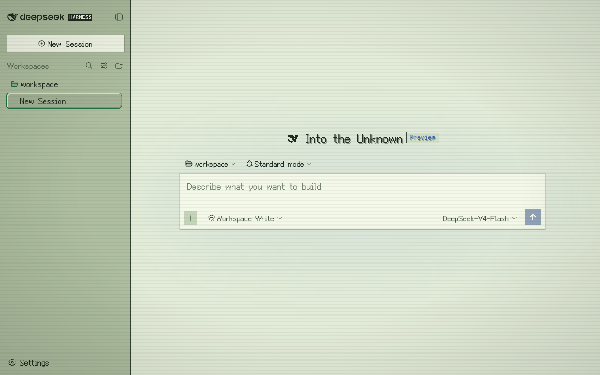
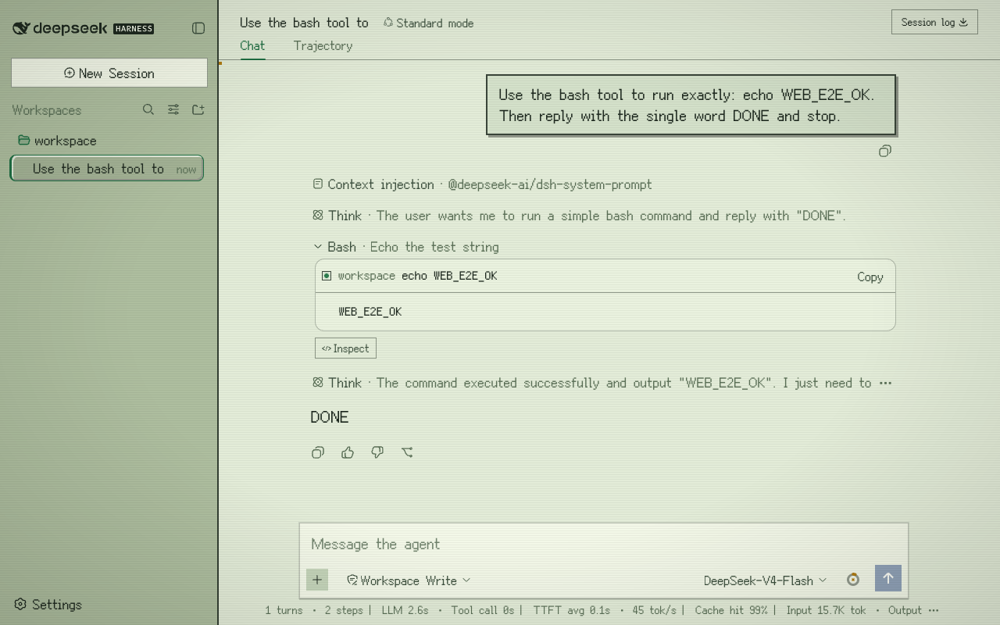
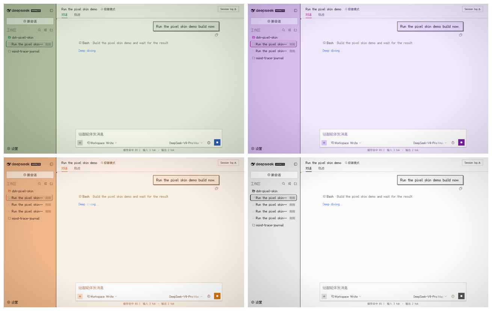
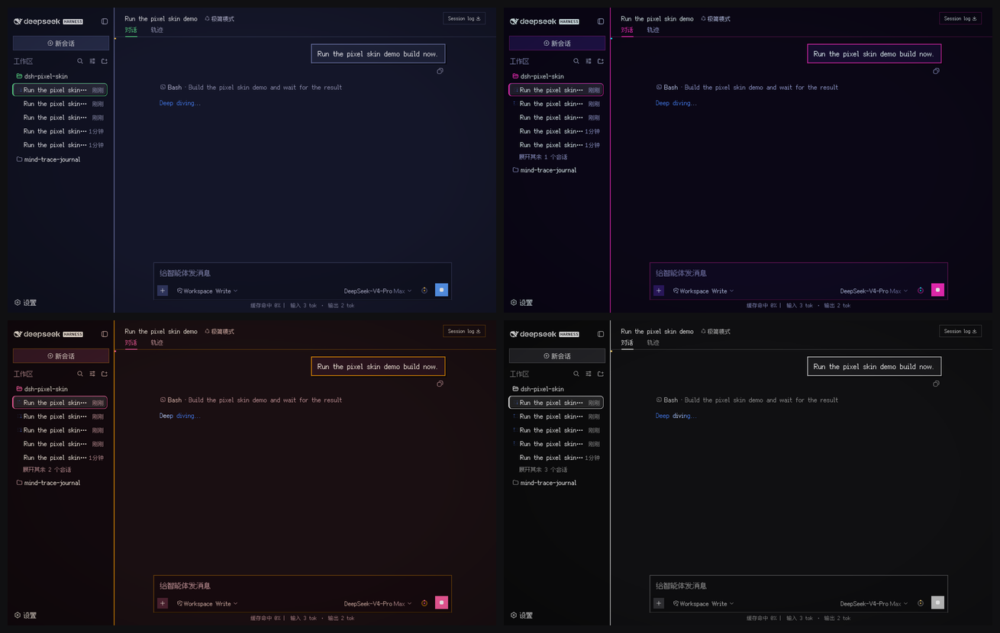

<div align="center">


# dsh-pixel-skin

**8-bit / CRT skin for the DeepSeek Harness web GUI.**

An out-of-tree web client plugin for [DeepSeek Harness](https://github.com/deepseek-ai/deepseek-harness). It keeps the host untouched and layers a full pixel-art treatment over the built-in light and dark themes.

[English](README.md) | [中文](README.zh.md)

</div>

---

## Screenshots

**New session**

<p align="center">
  
</p>

**In conversation, mid-work**

<p align="center">
  
</p>

**Switchable palettes**

<p align="center">
  
</p>

<p align="center">
  
</p>

Order: retro green · cyberpunk · sunset arcade · mono terminal.

Screenshots use the pixel skin with **Font mode → Pure pixel** enabled.

The working screenshot shows the conversation flow with Think and Bash tool rows.

---

## Features

- **Complete pixel palette** for light and dark mode, layered through the official `ctx.theme.overrideTokens` API.
- **Readable hybrid typography**
  - short UI chrome: `Fusion Pixel 12px Proportional SC`
  - long-form prose: Latin-only `Fusion Pixel Latin` subset + modern CJK fallbacks (`PingFang SC` / `Microsoft YaHei`)
  - code and terminals: `Fusion Pixel 12px Monospaced SC`
- **Generated font-size patch layer** — scans the adjacent harness checkout and fixes every component rule that still hard-codes 10–16px text, using the exact CSS-Module hashes from the same `lightningcss` options as the harness build.
- **Pixel document details**
  - hard-bordered markdown tables, blockquotes, pixel dividers and checkboxes
  - square code-language badges (`bash`, `json`, `ts`, …)
  - stepped skeleton shimmer
  - session-list tree markers
- **Switchable color palettes**
  - `retro` — green Game Boy / CRT (default)
  - `cyberpunk` — neon magenta + cyan
  - `sunset` — warm sunset arcade
  - `mono` — monochrome terminal
- **CRT atmosphere**
  - adjustable scanlines: off / light / standard
  - optional subtle vignette
  - optional 16×16 pixel cursor
- **Official favicon pixelated at 32×32** by a small sharp-based rasterizer; black whale in light mode, white in dark mode, just like the source.
- **Settings panel** under *Settings → General → Pixel skin*, persisted in `localStorage`; controls master on/off, palette swatches, scanlines, cursor, vignette, and font mode.
- **Dispose-safe** — the plugin removes its stylesheet, favicon, token overrides and body attributes when unmounted.
- **`prefers-reduced-motion` aware** — animations are disabled when the OS requests reduced motion.

## Typography modes

| Mode | UI chrome | Long-form body | Code |
| --- | --- | --- | --- |
| `hybrid` (default) | Pixel proportional SC | Pixel Latin + modern CJK | Pixel monospaced SC |
| `pure` | Pixel proportional SC | Pixel proportional SC | Pixel monospaced SC |

Switch between them in **Settings → General → Pixel skin → Font mode**.

## Requirements

- A checkout of `deepseek-harness` reachable at `../deepseek-harness` from this repository, or set `DSH_REPO` when building.
- The harness checkout must have both its client packages (`lib/client.js` artifacts) and the web frontend bundle (`apps/web/dist/assets/index-*.css`) built before the skin build scans their CSS Modules. In practice, a normal `pnpm run build` in the harness repo is enough.
- Node.js 22+.

## Build

```bash
cd dsh-pixel-skin
npm run build

# If the harness checkout lives somewhere else:
DSH_REPO=/path/to/deepseek-harness npm run build
```

The build generates:

- `src/client/font-data.ts` — base64-embedded Fusion Pixel fonts
- `src/client/literal-font-patches.ts` — hash-scoped readability patches for both the package CSS Modules and the final web bundle CSS of the current harness checkout
- `src/client/pixel-favicon.ts` — official favicon rasterized to a 32×32 grid
- `src/client/structural-patches.ts` — hash-scoped selectors for composer, stats line, and context ring
- `lib/index.js` — empty host plugin half
- `lib/client.js` — browser skin bundle

Rebuild the skin after pulling a new harness version or rebuilding its web packages.

After rebuilding, refresh the local web profile copy:

```bash
npm run refresh
```

This is required because pnpm installs `file:` profile dependencies as a copy,
not a symlink.

## Install into a dsh web profile

The package is a plain plugin, not a bundle.

```bash
dsh plugin --profile web add /absolute/path/to/dsh-pixel-skin
```

Then add to `$DSH_HOME/profiles/web/cordis.patch.yml`:

```yaml
- insert:
    - id: dsh-pixel-skin
      name: dsh-pixel-skin
```

Restart and refresh:

```bash
dsh --profile web
```

### Uninstall

Remove the `insert` block from `cordis.patch.yml`, then:

```bash
dsh plugin --profile web remove dsh-pixel-skin
```

## Project layout

```text
dsh-pixel-skin/
├── assets/
│   ├── dsh-pixel-icon.svg          # GitHub / favicon source
│   ├── fonts/                      # OFL-1.1 Fusion Pixel woff2 files
│   └── screenshots/                # README screenshots
├── scripts/
│   ├── build.mjs                   # font embedding + CSS-module patch generator
│   └── pixelate-favicon.mjs        # official favicon → 32×32 grid rasterizer
├── src/
│   ├── index.ts                    # empty host half
│   └── client/
│       ├── index.ts                # plugin entry
│       ├── palette.ts              # token overrides + font scale
│       ├── skin-style.ts           # global skin CSS
│       ├── pixel-details.ts        # pixel surface/details CSS
│       ├── settings.ts             # localStorage settings
│       ├── settings-row.ts         # Settings → General row
│       └── settings-row.module.css
└── lib/                            # built artifacts
```

## Fonts and licenses

The skin embeds the **Fusion Pixel** font family by TakWolf:

- `Fusion Pixel 12px Proportional SC`
- `Fusion Pixel 12px Monospaced SC`
- a generated Latin-only subset

All font files are licensed under the **SIL Open Font License 1.1**. See [`THIRD_PARTY_NOTICES.md`](THIRD_PARTY_NOTICES.md) and `assets/fonts/LICENSE.fusion-pixel.txt`.

The plugin code is licensed under **MIT**.

## Development notes

- The skin does **not** modify the `deepseek-harness` source tree.
- Colors ride the harness `--dsw-*` theme tokens; the skin never hard-codes a palette that bypasses light/dark resolution.
- CSS-Module selectors in the generated patch sheet are hash-scoped, not guessed from readable class names.
- The settings row is written against the harness slot and locale services, the same seam used by the built-in Appearance row.

## Known limitations

- The build must be run against an adjacent `deepseek-harness` checkout (`DSH_REPO` can override the location).
- Pulling or rebuilding the harness can change CSS-Module hashes in either package bundles or the web dist; run `npm run build` and `npm run refresh` again.
- A running `dsh web` process keeps its old plugin copy in memory; restart it after `npm run refresh`.
- Fonts are embedded as base64 in `lib/client.js`. They perform no network requests and are decoded by the browser only when a glyph is rendered; splitting them further is possible but not currently necessary.


